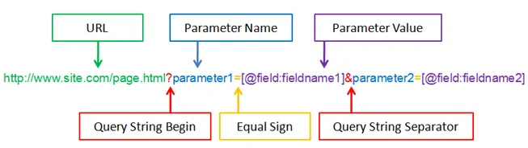

# 1 Query-String

Ein Query-String ist der Teil einer URL, der nach einem Fragezeichen steht und Daten in Form von Schlüssel-Wert-Paaren überträgt. Diese Paare werden durch ein Gleichheitszeichen verbunden und mit & getrennt.




```
https://example.com/pfad?schluessel1=wert1&schluessel2=wert2
```

Basis-URL: `https://example.com/pfad`
Query-String: `?schluessel1=wert1&schluessel2=wert2`


## 1.1 Anwendungen:
- Suchmaschine: https://www.google.com/search?q=query+string
    - q=query+string bedeutet, dass der Suchbegriff "query string" ist.
- API-Abfragen: https://api.weather.com/v3/weather?+city=Berlin&units=metric
    - Parameter: city=Berlin, units=metric
- Datenübertragung: https://example.com?user=admin
- Tracking/Filter: https://shop.com?kategorie=mode&sort=preis


## 1.2 Verarbeitung von Query-Strings 

Folgende Zeilen werden oft genutzt, um in einem HTTP-Server (z. B. mit `http.createServer`) die Daten zu lesen, die über den Query-String gesendet wurden.

- `const url = require('url');` lädt das eingebaute `url` Modul von Node.js, das Funktionen zum Analysieren und Verarbeiten von URLs bereitstellt. Es ermöglicht die Zerlegung von URLs in verschiedene Bestandteile wie Pfad, Host, Query-String usw.
- `const qs = require('querystring');` lädt das eingebaute `querystring` Modul, das speziell für das Verarbeiten von Query-Strings gedacht ist. Es kann Query-Strings in Objekte umwandeln und umgekehrt.
- ` let query = url.parse(req.url, true).query;` parst die URL der aktuellen Anfrage (`req.ur`l) und extrahiert den Query-String.
    - `url.parse(req.url, true)`
        - zerlegt die URL in ihre Bestandteile (Protokoll, Host, Pfad, Query-String, usw.)
        - Das Argument true bewirkt, dass der Query-String automatisch in ein Objekt umgewandelt wird.
    - .query
        - Greift direkt auf den Query-String in Objektform zu.
        - 得到结果是 jason array
    - Beispiel: angenommen, die URL lautet: "`/?name=Szymon&age=26`"

```js
let query = url.parse(req.url, true).query;
console.log(query); // { name: 'Szymon', age: '26' }
```


## 1.3 qs.parse()

qs.parse() ist eine Funktion aus der Library qs (Querystring), die speziell dafür entwickelt wurde, URL-Query-Strings in JavaScript-Objekte zu konvertieren. Diese Funktion wird häufig verwendet, um Daten, die in einer URL oder einem Query-String übermittelt werden, einfacher verarbeiten zu können.

```js
const qs = require('querystring');
const queryString = 'name=Szymon&age=26';
const result = qs.parse(queryString); // { name: 'Szymon', age: '26' }
```


Unterschiede url.parse vs qs.parse

| Eigenschaft        | url.parse mit .query                                 | qs.parse                              |
| ------------------ | ---------------------------------------------------- | ------------------------------------- |
| Modul              | url                                                  | querystring                           |
| Input              | vollständige URL                                     | nur der Query-String                  |
| Fokus              | zerlegt die gesamte URL (inkl. Protokoll, Host etc.) | arbeitet nur mit dem Query-String     |
| Anwendungs-bereich | HTTP-Anfragen oder komplexe URL-Verarbeitung         | Verarbeitung isolierter Query-Strings |
| Flexibilität       | bietet Zugriff auf alle URL-Bestandteile             | beschränkt sich auf den Query-String  |

url.parse:
- Wenn man mit URLs in HTTP-Anfragen arbeitet.
- Beispiel: Zerlegen der URL einer eingehenden Anfrage in einem Node.js-Server.
qs.parse:
- Wenn man bereits einen isolierten Query-String hat.
- Beispiel: Daten, die aus einem Formular gesendet wurden und in String-Form vorliegen.


# 2 .json() vs JSON.parse() vs JSON.stringify

| Funktion     | .json()                           | JSON.parse()                               | JSON.stringify()                            | qs.parse()                                         |
| ------------ | --------------------------------- | ------------------------------------------ | ------------------------------------------- | -------------------------------------------------- |
| Eingabe      | Response-Objekt                   | JSON-String                                | JavaScript-Objekt                           | Query-String                                       |
| Verwendung   | analysiert eine Antwort von fetch | wandelt einen JSON-String in ein Objekt um | konvertiert ein Objekt in einen JSON-String | extrahiert Daten aus einer URL und verarbeitet sie |
| Ausgabe      | JavaScript-Objekt                 | JavaScript-Objekt                          | JSON-String                                 | JavaScript-Objekt                                  |
| Synchronität | asynchron (Promise)               | synchron                                   | synchron                                    | synchron                                           |

## 2.1 .json()

- Kontext: .json() wird in der Fetch-API oder ähnlichen, auf Promises basierenden APIs verwendet.
- Anwendung: ist eine Methode des `Response`-Objekts, das von einem Fetch-`Request` zurückgegeben wird.
- Zweck: konvertiert den Body einer Antwort in ein JSON-Objekt.

Beispiel:
```js
fetch('https://api.beispiel.com/daten')
    .then(response => response.json())
    .then(daten => console.log(daten))
    .catch(fehler => console.error('Fehler:', fehler));
```


## 2.2 JSON.parse()

- Kontext: `JSON.parse()` wandelt einen JSON-String in ein JavaScript-Objekt um.
- Anwendung: wird verwendet, wenn Daten als JSON-String vorliegen und als Objekt benötigt werden.
- Zweck: parst einen `JSON`-String, damit er als JS-Objekt genutzt werden kann.

Beispiel:
```js
const jsonString = '{"name": "Szymon", "age": 26}';   // Type: json 
const myObject = JSON.parse(jsonString);
console.log(myObject.name); // "Szymon"
```


## 2.3 JSON.stringify()

- Kontext: JSON.stringify() wandelt ein JS-Objekt in einen JSON-String um.
- Anwendung: wird verwendet, um Daten (z. B. in einer HTTP-Anfrage) zu senden oder in einem JSON-kompatiblen Format zu speichern.
- Zweck: Serialisiert ein JavaScript-Objekt in einen JSON-kompatiblen String.

Beispiel:
```js
const myObject = { name: "Szymon", age: 26 }; // Tyoe: js-object
const jsonString = JSON.stringify(myObjekt);
console.log(jsonString); // '{"name":"Szymon","age":26}'
```


## 2.4 产生一个 kopie 

`res.locals.flights = JSON.parse(JSON.stringify(res.locals.flights));`

Die Zeile res.locals.flights = JSON.parse(JSON.stringify(res.locals.flights)); wird verwendet, um eine deep copy des res.locals.flights-Objekts zu erstellen.

Warum ist das notwendig?
In JavaScript werden Objekte und Arrays per Referenz gespeichert. Wenn `res.locals.flights` verändert wird, könnten auch die ursprünglichen Daten unbeabsichtigt geändert werden.
Mit dieser Zeile wird:
1. `JSON.stringify(res.locals.flights)` das Objekt in einen JSON-String umgewandelt.
2. ` JSON.parse(...) `diesen String zurück in ein neues JavaScript-Objekt umgewandelt.
Dadurch entsteht eine vollständige Kopie, die keine Verbindung mehr zu den ursprünglichen Daten hat.

Wann braucht man das?
- Wenn man sicherstellen möchte, dass Änderungen an `res.locals.flights` die Originaldaten nicht beeinflussen.
- Falls `res.locals.flights` verschachtelte Objekte oder Arrays enthalten würde, die unabhängig von der Originalquelle verändert werden sollen.
- Wenn man eine saubere Kopie für weitere Verarbeitung benötigt, ohne Seiteneffekte.


Beispiel zur Verdeutlichung
Ohne tiefe Kopie (Problem mit Referenzen)
```js
const original = { flight: "LH123", price: 200 };
const copy = original;

copy.price = 250; // ändert auch `original`, weil beide dieselbe Referenz haben

console.log(original.price); // 250 ❌ (sollte eigentlich 200 bleiben)
```

Mit tiefer Kopie (Problem behoben)
```js
const original = { flight: "LH123", price: 200 };
const copy = JSON.parse(JSON.stringify(original));

copy.price = 250; // Ändert nur die Kopie, nicht das Original

console.log(original.price); // 200 ✅ (unverändert)
```


# 3 http.createServer()

http.createServer() wird in Node.js verwendet, um einen HTTP-Server zu erstellen, der Anfragen von Clients (z. B. Browsern) empfängt und darauf reagiert.

Grundlegende Syntax:
```js
const http = require('http');

const server = http.createServer((req, res) => {
	// Hier kommt der Funktionsbody rein
});

server.listen(3000, () => {
    console.log('Server läuft auf http://localhost:3000');
});
```


Wie funktioniert http.createServer()?
3. Erstellt einen Server, der eine Callback-Funktion erhält.
    1.  req (Request-Objekt) → enthält Informationen über die eingehende Anfrage (z. B. URL, Header, Methode)
    2. res (Response-Objekt) → wird verwendet, um eine Antwort an den Client zu senden
4. Reagiert auf eingehende Anfragen (Response-Methoden, Daten-Stream-Handler)
5. Startet den Server mit .listen(PORT, callback)
    1. server.listen(3000, callback) → startet den Server auf einem bestimmten Port
    2. Der callback gibt eine Meldung in der Konsole aus, wenn der Server erfolgreich gestartet wurde
6. Standardmäßig ist http.createServer() für kleine Projekte geeignet, für größere Projekte ist Express.js besser.


# 4 Response-Methoden (res.writeHead, res.write, res.end)

Der Server hat bereits alle Daten für die Antwort und kann diese direkt senden.


## 4.1 res.writeHead(statusCode, headers)


- setzt den HTTP-Statuscode und die Header für die Antwort.
- `res.writeHead(200, { 'Content-Type': 'application/json' });`

Was bedeutet 'Content-Type': 'application/json' ?
- Der Header teilt dem Client mit, dass der Inhalt der Antwort ein JSON-Dokument ist.
- Der Client kann diese Information verwenden, um die Daten korrekt zu interpretieren und zu verarbeiten.


## 4.2 res.write(data)

- schreibt Daten in den Antwort-Body (kann mehrmals aufgerufen werden). Die Daten können in Form von Strings oder Buffern übergeben werden.

```js
res.write('Hello, ');
res.write('world!');
```


## 4.3 res.end(?data)
- beendet die Antwort und schließt den Antwort-Stream. Optional können dabei noch letzte Daten übergeben werden.
- `res.end('Goodbye!');`


## 4.4 Häufige Content-Type Header-Werte

Die Entscheidung, ob der Content-Type mit text/xxx oder application/xxx angegeben wird, hängt davon ab, wie der Inhalt behandelt werden soll und welche Art von Daten übertragen wird.

text/xxx
7. Dieser Typ wird verwendet, wenn der Inhalt aus lesbarem Text besteht, den Menschen direkt verstehen und interpretieren können.
8. Typische Eigenschaften:
    1. Der Inhalt kann direkt im Browser oder Texteditor angezeigt werden.
    2. Es wird davon ausgegangen, dass die Daten in einer bestimmten Textkodierung (z. B. UTF-8) vorliegen.


application/xxx
9. Dieser Typ wird verwendet, wenn die Daten nicht direkt als Text interpretiert werden können oder wenn sie eine spezifische Anwendung verarbeiten soll.
10. Typische Eigenschaften:
    1. Die Daten müssen von einer Anwendung oder einem Parser interpretiert werden.
    2. Sie können binär oder textuell sein.


---


text/plain

- Beschreibung: reiner Text ohne Formatierung
- Anwendungsfälle: Textantworten, Debuggen

Beispiel: einfache Texte wie Hello, World!
```js
res.writeHead(200, { 'Content-Type': 'text/plain' });
res.end('This is plain text.');
```

---


text/html

- Beschreibung: HTML-Dokumente
- Anwendungsfälle: dynamische oder statische HTML-Seiten

Beispiel: Webseiteninhalte
```js
res.writeHead(200, { 'Content-Type': 'text/html' });
res.end('<h1>Hello, HTML!</h1>');
```


----

application/json
- Beschreibung: JSON-Daten
- Anwendungsfälle: RESTful-APIs

Beispiel: APIs, die strukturierte Daten zurückgeben
```js
res.writeHead(200, { 'Content-Type': 'application/json' });
res.end(JSON.stringify({ name: 'Szymon', age: 26 }));
```


---

application/javascript
- Beschreibung: JavaScript-Code
- Anwendungsfälle: Bereitstellen von JS-Dateien

Beispiel: dynamische Skripte, die vom Browser ausgeführt werden sollen
```js
res.writeHead(200, { 'Content-Type': 'application/javascript' });
res.end('console.log("Hello, JavaScript!");');
```

---

text/css

Beschreibung: CSS-Dateien
Anwendungsfälle: statische oder dynamische CSS-Dateien

Beispiel: Übermitteln von CSS-Stylesheets
```js
res.writeHead(200, { 'Content-Type': 'text/css' });
res.end('body { background-color: lightblue; }');
```


---

image/jpeg, image/png, image/gif

Beschreibung: Bilddateien in verschiedenen Formaten
Anwendungsfälle: Laden von Bildern auf Webseiten

Beispiel: Übertragen von Bildern
```js
res.writeHead(200, { 'Content-Type': 'image/png' });
res.end(imageBuffer); // imageBuffer enthält die Binärdaten des Bildes
```


----

application/xml

Beschreibung: XML-Dokumente
Anwendungsfall: alte APIs oder spezifische Anforderungen

Beispiel: Dienste, die XML anstelle von JSON verwenden

```js
res.writeHead(200, { 'Content-Type': 'application/xml' });
res.end('<note><to>Szymon</to><from>Node.js</from></note>');
```


---

application/octet-stream

Beschreibung: Binärdaten ohne spezifischen Typ
Anwendungsfall: Dateidownloads
Beispiel: Herunterladen von Dateien (z. B. ZIP, EXE)

```js
res.writeHead(200, { 'Content-Type': 'application/octet-stream' });
res.end(binaryData); // binaryData enthält die Datei
```


---

multipart/form-data

Beschreibung: Binärdaten ohne spezifischen Typ
Anwendungsfall: Dateidownloads
Beispiel: Herunterladen von Dateien (z. B. ZIP, EXE)

```js
res.writeHead(200, { 'Content-Type': 'application/octet-stream' });
res.end(binaryData); // binaryData enthält die Datei

```


---


multipart/form-data


Beschreibung: Daten, die oft in Formularen verwendet werden (einschließlich Datei-Uploads)
Anwendungsfälle: Datei-Uploads oder komplexe Formularverarbeitung

Beispiel: Hochladen einer Datei via POST

```js
res.writeHead(200, { 'Content-Type': 'multipart/form-data' });
res.end(formData);
// formData enthält die Formulardaten
```


---


application/pdf

Beschreibung: PDF-Dateien
Anwendungsfälle: Downloads oder das Anzeigen von PDF-Dateien im Browser
Beispiel: Bereitstellen von Dokumenten

```js
res.writeHead(200, { 'Content-Type': 'application/pdf' });
res.end(pdfBuffer); // pdfBuffer enthält die Binärdaten des PDF.
```

---


application/x-www-form-urlencoded

Beschreibung: Formulardaten, die als Key-Value-Paare im URL-ähnlichen Format kodiert sind
Anwendungsfall: Übermittlung von Daten aus HTML-Formularen oder bei API-Requests.

```js
res.writeHead(200, { 'Content-Type': 'application/x-www-form-urlencoded' });
res.end('name=Szymon&age=26');
```


# 5 Daten-Stream-Handler (.on('data'), .on('end'))

Der Server empfängt neue Daten (z.B. als Request eines Clients, oder als Antwort von einem anderen Server).

## 5.1 `.on('data', callback)`

wird ausgelöst, wenn ein neuer Datenblock (chunk) der Anfrage eingeht. Die Daten werden asynchron stückweise als Parameter an den Callback übergeben.

```js
let body = '';
req.on('data', chunk => {
	// Konvertiert den Chunk in einen String und fügt ihn zum Body hinzu.
	body += chunk.toString(); 
});
```


Warum toString() verwenden?
- Die `Chunks`, die durch das `data`-Event empfangen werden, kommen standardmäßig als Buffer-Objekte in Node.js an.
- Ein Buffer ist ein spezieller Datentyp, der binäre Daten speichert und verarbeitet um eine speichereffiziente Verarbeitung großer Datenmengen zu ermöglichen.
- Wenn man die empfangenen Daten als Text (z. B. JSON, Formulardaten oder HTML) verarbeiten möchte, muss man den Buffer in einen String umwandeln.

```js
const chunk = Buffer.from('Hello');
console.log(chunk); // Ausgabe: <Buffer 48 65 6c 6c 6f>
console.log(chunk.toString()); // Ausgabe: 'Hello'
```

Beispiel
Bei einer HTTP-POST-Anfrage mit JSON-Daten wie:
```js
{ "name": "Szymon", "age": 26 }
```

`[…] `der empfangene Buffer sieht etwa so aus:
```
<Buffer 7b 22 6e 61 6d 65 22 3a 22 53 7a 79 6d 6f 6e 22 2c 22 61 67 65 22 3a 32 36 7d>
```


Nach chunk.toString() ergibt sich:
```
'{"name": "Szymon", "age": 26}'
```


# 6 .on('end', callback)

- wird ausgelöst, wenn die gesamte Anfrage empfangen wurde (wenn keine weiteren Daten mehr ankommen).
- Node.js erkennt, dass keine weiteren Daten mehr kommen, durch Informationen des zugrunde liegenden Protokolls:

11. HTTP
    1. `Content-Length `Header: gibt die genaue Datenmenge an.
    2. Chunked Transfer-Encoding: signalisiert das Ende durch einen speziellen 0-Byte-Chuck.
12. TCP
    1. Der Sender schließt die Verbindung mit einem FIN-Paket, das Node.js verarbeitet.
13. Streams:
    1. Node.js arbeitet mit Readable Streams, die von der API definiert sind:
        1. Das Ende eines Streams wird durch die Methode stream.push(null) signalisiert.
        2. Die interne Implementierung der Protokolle (z. B. HTTP oder TCP) sorgt dafür, dass Node.js automatisch null pusht, wenn das Ende erreicht ist.

```js
req.on('end', () => {
	// Hier ist der gesamte Body verfügbar.
	console.log('Request body:', body); 
});
```


