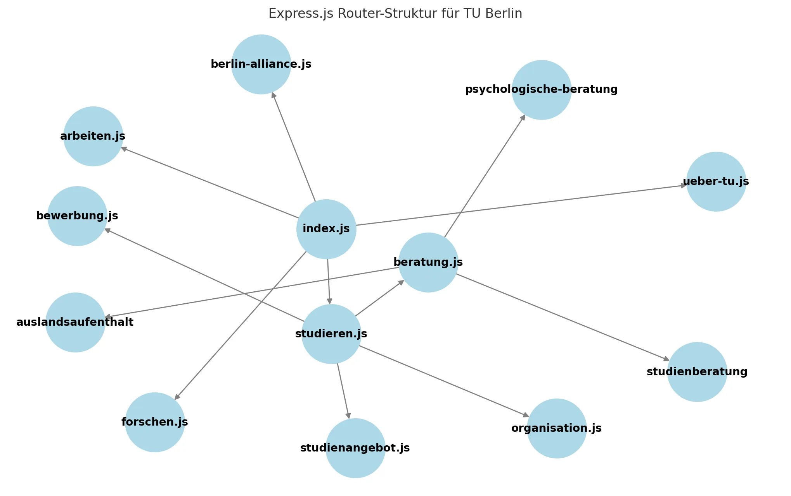

# 1 Express: Einführung

Express (oder Express.js) ist ein minimalistisches und flexibles Web-Framework für Node.js, das für die Entwicklung von Backend-Anwendungen verwendet wird. Es vereinfacht das Erstellen von APIs und Webservern, indem es eine einfache Möglichkeit bietet, Routen zu definieren, Middleware zu nutzen und mit HTTP-Anfragen zu arbeiten.

Warum Express für das Backend?
- Leichtgewichtig & schnell: Es baut direkt auf Node.js auf und verzichtet auf unnötigen Ballast.
- Middleware-Unterstützung: Man kann Funktionen zwischenschalten, um Anfragen zu bearbeiten (z. B. Authentifizierung, Logging).
- Einfaches Routing: Definition der Routen wie `/users`, `/login` usw. mit wenig Code.


# 2 Worauf man achten sollte, wenn man von Node.js zu Express wechselt

- Routing: In reinem Node.js muss man Anfragen manuell analysieren und darauf reagieren. Express bietet eine klarere Routing-API mit Methoden wie `app.get()` oder `app.post()`.
- Middleware: Express nutzt Middleware-Funktionen, die Anfragen vorverarbeiten (z. B. JSON-Parsing mit `express.json()`). In reinem Node.js müsste man dies mit `req.on('data', ...)` und `req.on('end', ...)`manuell machen.
- Fehlermanagement: Express hat integrierte Fehlerbehandlung (next(err)), während man in Node.js explizit mit try-catch oder on('error', ...) arbeiten muss.

```js
const express = require('express');
const app = express();

// Route für die Startseite
app.get('/', (req, res) => {
		res.send('Hello, Express!');
});

// 404-Fehlerbehandlung für alle anderen Routen
app.use((req, res) => {
		res.status(404).send('Seite nicht gefunden');
});

// Server starten
app.listen(3000, () => {
		console.log('Server läuft auf Port 3000');
});
```


Der gleiche Server in reinem Node.js, ohne Express, würde so aussehen:
```js
const http = require('http');

const server = http.createServer((req, res) => {
		// Route für die Startseite
		if (req.method === 'GET' && req.url === '/') {
			  res.writeHead(200, { 'Content-Type': 'text/plain' });
		    res.end('Hello, Node.js!');
	  }
	  // 404-Fehlerbehandlung für alle anderen Routen
	  else { 
			  res.writeHead(404, { 'Content-Type': 'text/plain' });
		    res.end('Seite nicht gefunden');
	  }
});

// Server starten
server.listen(3000, () => {
		console.log('Server läuft auf Port 3000');
});
```

# 3 Erweiterung von Connect


Route Path
Route Method
Routing
Route Handler
Template Engine

- Connect: Einbindung von Middleware-Funktionen für Infrastrukturaufgaben
- Express: Erweiterung von Connect um Mechanismen zur Erledigung von Infrastrukturaufgaben
- Express kapselt Connect, d.h. Objekte und Methoden von Connect stehen auch in Express zur Verfügung


- Route Path: Endpunkt einer Webanwendung (Pfadnamen einer URI)
- Route Method: HTTP-Methode für die eine Route definiert ist
- Routing
    - Bearbeitung einer HTTP-Anfrage und Erstellung der Antwort . 
    - Genauer: Durchleiten einer Anfrage durch Middleware-Funktionen und verschiedene Module der Webanwendung und Zurückleitung der Antwort
- Route Handler: Callback-Funktion einer Middleware-Funktion bzw. eines Moduls der Webanwendung
- Template Engine: Erstellung von dynamischen HTML-Ausgaben basierend auf Templates


## 3.1 Integrierte Module


Anfragen und Antworten 

| Modul                | Beschreibung                                                                                                                                                                                          |
| -------------------- | ----------------------------------------------------------------------------------------------------------------------------------------------------------------------------------------------------- |
| `**basicAuth**`      | - Fügt einer Anwendung Unterstützung für die http-Authentifizierung hinzu  <br>- Authentifizierung erfolgt über einen Callback, so dass beliebige Strategien implementiert werden können              |
| `**compress**`       | - Komprimierung von ausgehenden Antworten auf Basis von `gzip` und `deflate`  <br>- Modul prüft eigenständig, ob der vom Benutzer verwendete Webbrowser komprimierte Daten akzeptiert                 |
| `**csrf**`           | - Schützt Webanwendungen vor Cross Site Request Forgery  <br>- Generiert für jeden Benutzer ein Token, welches bei jeder Anfrage validiert wird  <br>Benötigt die Module `cookieParser` und `session` |
| `**limit**`          | - Begrenzt das vom Webserver akzeptierte Datenvolumen von eingehenden Anfragen  <br>- Überschreitet die Größe einer Anfrage das zulässige Datenvolumen, wird diese abgebrochen                        |
| `**methodOverride**` | - Fügt einer Anwendung Unterstützung für unechte http-Methoden hinzu                                                                                                                                  |
| **`responseTime`**   | - Berechnet die Zeit, die zur Beantwortung einer eingehenden Anfrage benötigt wird, und sendet diese als Header in der ausgehenden Antwort an den Webbrowser zurück                                   |

---


Parser

| Modul              | Beschreibung                                                                                                                                                           |
| ------------------ | ---------------------------------------------------------------------------------------------------------------------------------------------------------------------- |
| `**bodyParser**`   | - Verarbeitet den Body von eingehenden Anfragen  <br>- Unterstützt die Formate `json`, `urlencoded` und `multipart`                                                    |
| `**cookieParser**` | - Analysiert die in einer eingehenden Anfrage enthaltenen Cookies  <br>- Stellt Cookies im Objekt `req.cookies` zur Verfügung                                          |
| `**json**`         | - Verarbeitet den Body von eigehenden Anfragen  <br>- Unterstützt das Format `json`  <br>- Wird intern vom `bodyParser`-Modul verwendet                                |
| `**multipart**`    | - Verarbeitet den Körper von eigehenden Anfragen  <br>- Unterstützt das Format `multipart/form-data`  <br>- Wird intern vom `bodyParser`-Modul verwendet               |
| `**urlencoded**`   | - Verarbeitet den Körper von eigehenden Anfragen  <br>- Unterstützt das Format `application/x-www-form-urlencoded`  <br>- Wird intern vom `bodyParser`-Modul verwendet |


----


 Webserver und Sessions

|Modul|Beschreibung|
|---|---|
|`**cookieSession**`|- Erstellt Sitzungen (Sessions) auf Basis von Cookies  <br>- Gesamte Session wird in ein Cookie serialisiert und von dort wieder serialisiert|
|`**directory**`|- Formatierte Ausgabe einer Dateiliste für ein angegebenes Verzeichnis  <br>- Verwendung von Filtern möglich  <br>- Möglichkeit der Ausgabe versteckter Dateien|
|`**favicon**`|- Sendet die Datei `favicon`  <br>- favicon: Kofferwort von favorite und icon (d.h. Favoritensymbol)  <br>- Verwendung eines Caches, so dass die Datei nicht für jede Anfrage aus dem Dateisystem gelesen werden muss|
|`**session**`|- Fügt einer Webanwendung Unterstützung für Sessions hinzu  <br>- Sessions werden durch `SessionID` repräsentiert, die durch Cookies transportiert werden  <br>- Zustand einer Session wird im Arbeitsspeicher gehalten  <br>- Alternative Einbindung persistenter Speicherlösungen möglich  <br>- Erfordert `cookieParser`-Modul|
|`**static**`|- Senden von statischen Dateien aus dem Dateisystem  <br>- Kein Caching|
|**`staticCache`**|- Cache für das static-Modul  <br>- Umsetzung einer `Least-Recently-Used`-Strategie  <br>- Begrenzung der Anzahl und der Größe der gecachten Dateien|

---

Werkzeuge 

| Modul              | Beschreibung                                                                                                                      |
| ------------------ | --------------------------------------------------------------------------------------------------------------------------------- |
| `**errorHandler**` | - Vorgefertigtes Fehler-Modul  <br>- Liefert im Falle eines Fehlers die entsprechende Fehlermeldung als Antwort an den Webbrowser |
| `**logger**`       | - Protokolliert alle eingehenden Anfragen in einem übergebenen Stream                                                             |


## 3.2 Route Wichtige Methoden und Objekte im Überblick


Methoden des Application-Objekts

|Methoden|Beschreibung|
|---|---|
|`**app.set(name, value)**`|Setzt eine Umgebungsvariable zur Konfiguration von Express|
|`**app.get(name)**`|Liest den Wert einer Umgebungsvariablen|
|`**app.use([path], callback)**`|Fügt eine Middleware-Funktion in Form eines Callbacks in die Route der Webanwendung ein und bindet sie optional in ein bestimmtes Verzeichnis|
|`**app.VERB(path, [callback...], callback)**`|Fügt eine oder mehrere Module der Webanwendung hinzu und bindet sie an ein bestimmtes Verzeichnis und eine bestimmte HTTP-Methode|


Eigenschaften des Request-Objekts

|Methoden und Objekte|Beschreibung|
|---|---|
|`**req.query**`|Enthält die Query-String-Parameter einer aufgerufenen URL|
|`**req.params**`|Enthält die Routing-Parameter einer URL|
|`**req.body**`|Enthält den Body-Teil einer Anfrage, unterstützt durch bodyParser|
|`**req.param(name)**`|Liefert den Wert eines bestimmten Anfrageparameters|
|`**req.path**`, `**.host**` und `**.ip**`|Liefern Pfad, Hostname und IP-Adresse|
|`**req.cookies**`|Liefern Cookies einer Anfrage, bestimmt durch das cookieParser-Modul|


Eigenschaften des Response-Objekts

| Methoden und Objekte                       | Beschreibung                                                                                                                   |
| ------------------------------------------ | ------------------------------------------------------------------------------------------------------------------------------ |
| `**res.status(code)**`                     | Setzt den Status-Code einer HTTP-Antwort                                                                                       |
| `**res.set(field, [value])**`              | Setzt Parameter des Antwort-Headers                                                                                            |
| `**res.cookie(name, value, [options])**`   | Setzt Antwort-Cookie                                                                                                           |
| `**res.redirect([status], url)**`          | Anweisung eines Redirects zur der angegebenen URL                                                                              |
| `**res.send([body \| status], [body])**`   | Zusammenstellung der HTTP-Antwort und automatische Definition wichtiger Header-Parameter, z.B. Content-Type und Content-Length |
| `**res.render(view, [locals], callback)**` | Zusammenstellung einer HTML-Seite basierend auf einem Template                                                                 |


## 3.3 Route Handlers


- `**app.VERB**` mit `**VERB=get**`, `**post**`, `**put**` usw. übergibt Route Handler (Callback-Funktion) für die Beantwortung von HTTP-Anfragen einer bestimmten Methode an einen bestimmten Pfad
- `**app.all**` bindet alle Methoden an einen Route Handler, d.h. Ausführung geschieht unabhängig von der verwendeten HTTP Methode

```js
let express=require('express');
let app=express();

app.get('/', function(req, res) {
  res.send('GET request to the homepage');
});

app.post('/', function(req, res) {
  res.send('POST request to the homepage')
});

app.all('/secret', function(req, res, next) {
  console.log('Betreten des geschützten Bereichs');
  next();
});
```


## 3.4 Route Paths


Zeichenketten
```js
let express=require('express');
let app=express();

...
app.get('/', function(req, res) {
  res.send('Anfrage an / (root)');
});

app.get('/about', function(req, res) {
  res.send('Anfrage an /about');
});

app.get('/random.txt', function(req, res) {
  res.send('Anfrage an /random.txt');
});
```


Parameter
```js
let express=require('express');
let app=express();

...
app.get('/foo/:id', function(req, res) {
  res.send('Anfrage an /foo/123 oder /foo/456 usw.');
});

app.get('/foo/:id/:subid', function(req, res) {
  res.send('Anfrage an /foo/123/456 oder /foo/456/789 usw.');
});
```


Reguläre Ausrücke
```js

let express=require('express');
let app=express();

...
app.get('/ab?cd', function(req, res) {
  res.send('Anfrage an /acd oder /abcd');
});

app.get('/ab+cd', function(req, res) {
  res.send('Anfrage an /abcd, /abbcd, /abbbcd usw.');
});

app.get('/ab*cd', function(req, res) {
  res.send('Anfrage an /acd, /abcd, /abbcd usw.');
});

app.get('/ab(cd)?e', function(req, res) {
  res.send('Anfragen an /abe und /abcde')
});

app.get('/.*fly$/', function(req, res) {
  res.send('Anfragen an z.B. /butterfly/ oder /dragonfly/ im Pfadnamen, aber nicht /butterflyman/');
});
```


## 3.5 Registrierung von Route Handlers


Ein Route Handler
```js

let express=require('express');
let app=express();

app.get('/example/a', function(req, res) {
  res.send('Hallo von /example/a');
});
```


Mehrere Route Handler
```js

let express=require('express');
let app=express();

app.get('/example/b', function(req, res, next) 
    {
      res.write('Weiterleitung zur nächsten Middleware');
      next(); 
      res.end();
    }, 
    function(req, res) {
      res.write('Hallo von /example/b');
    }
);
```


Mehrere Route Handler als Array
```js

let express=require('express');
let app=express();

let c0=function(req, res, next) {
  console.log('c0'); next(); 
  res.send('Hallo von /example/c');
};
let c1=function(req, res, next) {
  console.log('c1'); next;
};
let c2=function(req, res) {
  console.log('c2');
};
app.get('/example/c', [c0, c1, c2]);
```


## 3.6 Konfiguration von Route Handlers mittels Router


Router – Zusammenstellung einer Middleware

这个文件存在了 `.vorlesung` 下 
```js
let express=require('express');
let router=express.Router();

router.use(function timelog(req, res, next) {
  console.log('Time: '+ Date.now());
  next();
});

router.get('/', function(req, res) {
  res.send('Homepage der Vorlesung');
});

router.get('/about', function(req, res) {
  res.send('Über die Vorlesung');
});

module.exports=router;

```


Einhängen eines Routers in einen Pfad
```js
let express=require('express');
let app=express();

let webtech=require('./vorlesung');
app.use('/webtech', webtech);

```


## 3.7 HTML Templates und Template Engines

JADE
```html
html
	head
    	title!=title
	body
    	h1!=message

```


Embedded JavaScript Template (EJS)
```html
<!DOCTYPE html>
<html>
  <head>
    <title><%= title %></title>
  </head>
    <body>
      <h1><%= message %></h1>
    </body>
</html>
```

Nutzung von Templates
在 执行一个 get request 的时候, 去执行渲染 一个预定以好的 html template 
```js
...
//Einbindung der Template Engine
app.set('view engine', 'ejs');

//Übergabe des Template-Verzeichnisses
app.set('views', '/app/views');   //  /app/views 这个文件夹下有一个 名字 为 index 的文件 

//Füllen des Templates mit Daten
// 这个是怎么知道 要去 render 那个 template 的 
app.get('/', function(req, res) {
  res.render('index', {title: 'Hey', message: 'Hallo!'});
});
```


- **_Template Engines_** unterstützen die Generierung dynamischer HTML-Seiten mit Hilfe vorgefertigter **_Templates_** (Vorlagen)
- Templates enthalten statischen HTML-Code sowie Parameter, die vor der Auslieferung mit Werten belegt werden (vergleiche PHP oder Java Server Pages)
- Unterstützte Template-Formate bzw. Template Engines
    - Jade
    - Embedded JavaScript (EJS)
    - JavaScript HTML (JsHTML)
- Einbindung einer Template Engine in eine Webanwendung durch Umgebungsvariable `**view engine**`
- Übergabe des Template-Verzeichnisses durch Umgebungsvariable `**views**`


# 4 Middleware

Eine Middleware in Express (und generell in Backend-Frameworks) ist eine Funktion, die zwischen einer eingehenden Anfrage (request) und einer ausgehenden Antwort ausgeführt wird. Sie kann Anfragen verarbeiten, verändern oder weiterleiten.
- Eine Middleware, zwei Middleware, mehrere Middleware → unzählbar (wie "Software" oder "Hardware")

Was kann eine Middleware tun?
- Anfragen modifizieren (z. B. JSON-Daten parsen)
- Authentifizierung prüfen
- Logging (z. B. jede Anfrage in der Konsole anzeigen)
- Fehlerbehandlung übernehmen
- Weiterleitung zur nächsten Middleware oder Route
- Jede Middleware kann mit `next()` an die nächste passende Middleware weitergeben.

```js
const express = require('express');
const app = express();

// Eine Middleware, die jede Anfrage loggt
app.use((req, res, next) => {
    console.log(`${req.method} ${req.url}`);
    next(); // sorgt dafür, dass die nächste Middleware oder die Route ausgeführt wird.
});

// Route
app.get('/', (req, res) => {
    res.send('Hello, Express!');
});

app.listen(3000, () => {
    console.log('Server läuft auf Port 3000');
});
```


## 4.1 Middleware-Typen

|   |   |
|---|---|
|Methode|Funktion|
|.use()|wird für Middleware-Funktionen verwendet, die auf alle oder bestimmte Routen angewendet werden. Häufig genutzt für Logging, Authentifizierung oder das Parsen von Anfragen.|
|.get()|wird für das Abrufen von Daten verwendet, z. B. das Laden einer Webseite oder das Abrufen von JSON-Daten in einer API. Der Server sendet eine Antwort ohne Änderungen an der Datenbank.|
|.post()|wird genutzt, um Daten an den Server zu senden, z. B. bei Formularen oder JSON-APIs. Häufig verwendet für das Erstellen neuer Ressourcen in einer Datenbank.|
|.put()|aktualisiert eine vorhandene Ressource komplett und überschreibt alle alten Werte. Falls die Ressource nicht existiert, kann sie in manchen Implementierungen neu erstellt werden.|
|.patch()|ähnlich wie .put(), aber es werden nur bestimmte Teile der Ressource aktualisiert, nicht die gesamte. Nützlich, wenn nur einzelne Felder einer Datenbank geändert werden sollen.|
|.delete()|löscht eine Ressource anhand der angegebenen URL oder ID. Wird häufig für API-Endpunkte verwendet, um Daten aus einer Datenbank oder einem Speicher zu entfernen.|
|.all()|wird genutzt, um eine Middleware oder einen Handler für alle HTTP-Methoden (GET, POST, PUT, DELETE etc.) einer bestimmten Route zu definieren. Praktisch für globale Regeln oder Authentifizierungschecks.|
|.options()|beantwortet Anfragen zu den erlaubten HTTP-Methoden einer bestimmten Route.|
|.route()|erlaubt das Gruppieren mehrerer Methoden für dieselbe Route, um den Code strukturierter und übersichtlicher zu gestalten. Dadurch kann man mehrere .get(), .post(), .put()-Handler an einer Stelle zusammenfassen.|
|.param()|wird genutzt, um bestimmte URL-Parameter zu erkennen und eine Middleware darauf anzuwenden. Hilfreich, wenn eine Aktion für eine bestimmte ID oder einen Parameter ausgeführt werden soll, bevor die Hauptlogik startet.|
|Fehler-Middleware|spezielle Middleware, die Fehler in der Anwendung erkennt und behandelt. Muss als letztes definiert werden und hat vier Parameter: app.use((err, req, res, next) => {...}), um Fehler weiterzugeben oder eine Fehlerseite anzuzeigen.|

1 .use() – Globale oder spezifische Middleware
- wird für allgemeine Middleware genutzt (z. B. Logging, Authentifizierung).
- gilt für alle oder bestimmte Routen.

```js
app.use(express.json()); // aktiviert JSON-Parsing für alle Anfragen
app.use('/admin', authMiddleware); // Middleware nur für `/admin`-Routen
```

---

2 .post() – Daten senden (z. B. Formulare, APIs)

wird für POST-Anfragen genutzt, wenn Daten an den Server gesendet werden.
```js
app.post('/login', (req, res) => {
    res.send(`Login mit ${req.body.username}`);
});
```


---

3 .put() – Ganze Ressource ersetzen
Wird für PUT-Anfragen genutzt, wenn eine Ressource komplett überschrieben wird.
```js
app.put('/user/:id', (req, res) => {
    res.send(`User mit ID ${req.params.id} wurde aktualisiert`);
});
```


4 .delete() – Ressource löschen
wird für DELETE-Anfragen genutzt, um etwas zu entfernen.

```js
app.delete('/user/:id', (req, res) => {
    res.send(`User mit ID ${req.params.id} wurde gelöscht`);
});
```


---

5 .all() – Für ALLE HTTP-Methoden
wird verwendet, um eine Middleware oder einen Handler für alle Methoden (GET, POST, PUT, DELETE, etc.) zu registrieren.

```js
app.all('/admin', (req, res) => {
    res.send('Diese Route akzeptiert alle HTTP-Methoden');
});
```


---

6 .options() – Unterstützte Methoden abrufen
wird genutzt, um herauszufinden, welche HTTP-Methoden eine Route unterstützt.

```js
app.options('/data', (req, res) => {
    res.set('Allow', 'GET, POST, PUT');
    res.send();
});
```

---

7 .route() – Gruppierung von Routen
mehrere Methoden für eine Route zusammenfassen
```js
app.route('/profile')
    .get((req, res) => res.send('Profil anzeigen'))
    .post((req, res) => res.send('Profil erstellen'))
    .put((req, res) => res.send('Profil aktualisieren'));
```


---

8 .param() – Middleware für bestimmte URL-Parameter
wird verwendet, um bestimmte Parameter von der Anfrage zu verarbeiten.

```js
app.param('userId', (req, res, next, id) => {
    console.log(`User ID: ${id}`);
    next();
});

app.get('/user/:userId', (req, res) => {
    res.send(`User ID ist ${req.params.userId}`);
});
```

----

9 Fehler-Middleware (app.use(err, req, res, next))
- spezielle Middleware für Fehlerbehandlung
- wird nur aufgerufen, wenn ein Fehler auftritt.

```js
app.use((err, req, res, next) => {
    console.error(err.stack);
    res.status(500).send('Etwas ist schiefgelaufen!');
});
```


## 4.2 Was sind `res.locals`?

`res.locals` ist ein speicherbarer Kontext innerhalb einer Anfrage, der genutzt wird, um Daten während des gesamten Request-Response-Zyklus weiterzugeben. Es ist eine objektbasierte Möglichkeit, Werte innerhalb von Middleware-Funktionen oder Routen-Handlern zu speichern und an nachfolgende Middleware weiterzuleiten.
- Jede Anfrage erhält ihr eigenes `res.locals` Objekt.
- Die darin gespeicherten Werte sind nur für die Dauer der aktuellen Anfrage gültig.
- Geeignet, um Daten zwischen Middlewares und Route-Handlern weiterzugeben

```js
app.use((req, res, next) => {
    res.locals.user = { name: "Szymon", role: "admin" };  // Nutzerinformation
    next();
});

app.get('/dashboard', (req, res) => {
    res.send(`Hallo ${res.locals.user.name}, dein Status ist ${res.locals.user.role}.`);
});
```


## 4.3 Middleware-Fluss: 

In Express.js bestimmt die Reihenfolge, in der Middleware-Funktionen definiert sind, wie eine Anfrage verarbeitet wird. Jede Middleware kann entweder:
- Die Anfrage direkt beantworten (res.send()), oder
- Die Anfrage an die nächste passende Middleware weitergeben (next()).

Das bedeutet, dass Express von oben nach unten alle passenden Middleware-Funktionen durchläuft, ==bis entweder res.send() aufgerufen wird oder keine passende Middleware mehr existiert (dann gibt es einen 404 Fehler)==.

规律
- Middleware werden in der Reihenfolge ausgeführt, in der sie definiert wurden.
- Globale Middleware (`app.use()`) läuft zuerst und setzt oft Variablen oder führt Logging durch.
- Mehrere Middlewares für denselben Pfad (z. B. `/user`) werden nacheinander ausgeführt, wenn `next()` genutzt wird.
- `next()` gibt die Kontrolle an die nächste passende Middleware weiter.
- Sobald `res.send()` aufgerufen wird, ist die Anfrage beendet – `next()` wird dann nicht mehr benötigt.
- Falls `next() `und `res.send() `nicht ausgeführt werden, bleibt die Anfrage "hängen".
- Falls keine passende Route existiert, wird die letzte `app.use()` Middleware für 404 ausgeführt.

Beispiel
```js
const express = require('express');
const app = express();

// eine globale Middleware, die für ALLE Anfragen gilt
app.use((req, res, next) => {
    console.log('Globale Middleware: Gilt für jede Anfrage');
    req.startTime = Date.now(); // speichert den Startzeitpunkt der Anfrage
    next(); // weiter zur nächsten passenden Middleware
    // je nachdem was der eingegebene Pfad sein wird, kann es die Middleware 1 
    // für "/user", die Middleware für "/about" oder die Middleware für nicht 
    // definierte Routen sein
});

// Middleware 1 für GET-Anfragen an "/user"
app.get('/user', (req, res, next) => {
    console.log('Middleware 1: /user - Setzt req.user');
    req.user = { name: 'Szymon' }; // fügt ein User-Objekt zur Anfrage hinzu
    next(); // weiter zur nächsten passenden Middleware 
    // in diesem Fall ist es die Middleware 2 für "/user"
});

// Middleware 2 für "/user"
app.get('/user', (req, res, next) => {
    console.log('Middleware 2: /user - Fügt eine Rolle hinzu');
    req.user.role = 'Tutor';
    next(); // weiter zur nächsten passenden Middleware
    // in diesem Fall ist es die Middleware 3 für "/user"
});

// Middleware 3 für "/user", die die Antwort sendet
app.get('/user', (req, res) => {
    console.log('Middleware 3: /user - Antwort wird gesendet');
    res.send(req.user);
    // kein next() notwendig, da sofort geantwortet wird
});

// eine Middleware für "/about"
app.get('/about', (req, res) => {
    console.log('Middleware 1: /about - Antwort wird gesendet');
    res.send({ 
        page: 'About', 
        time: new Date(req.startTime).toUTCString()
    });
    // kein next() notwendig, da sofort geantwortet wird
});

// eine allgemeine Middleware für nicht definierte Routen (404)
app.use((req, res) => {
    console.log('404 Middleware: Keine Route gefunden');
    res.status(404).send('Seite nicht gefunden');
});

// Server starten
app.listen(3000, () => console.log('Server läuft auf Port 3000'));
```

---

1 Was passiert, wenn jemand `GET /user` aufruft?
Der Server prüft die Reihenfolge der Middleware und führt die passenden aus.
1. Globale Middleware (`app.use(...)`) wird aufgerufen.
    1. `req.startTime` wird gesetzt.
    2. `next()` wird aufgerufen → geht zur nächsten Middleware.
2. Middleware 1 für` /user` wird aufgerufen.
    1. `req.user = { name: 'Szymon' }` wird gesetzt.
    2. `next()` wird aufgerufen → geht zur nächsten /user Middleware.
3. Middleware 2 für` /user` wird aufgerufen.
    1. `req.user.role = 'Tutor'` wird hinzugefügt.
    2. `next()` wird aufgerufen → geht zur nächsten /user Middleware.
4. Middleware 3 für `/user` wird aufgerufen und sendet die Antwort (`res.send(req.user)`).
    1. Hier wird die Antwort an den Client gesendet.
    2. `next()` wird NICHT aufgerufen, da `res.send()` die Anfrage beendet.

Konsolenausgabe:
```yml
Globale Middleware: Gilt für jede Anfrage
Middleware 1: /user - Setzt req.user
Middleware 2: /user - Fügt eine Rolle hinzu
Middleware 3: /user - Antwort wird gesendet
```

Antwort an den Client:
```
{
    "name": "Szymon",
    "role": "Tutor"
}
```

---
2 Was passiert, wenn jemand `GET /about` aufruft?
1. Globale Middleware (app.use(...)) wird aufgerufen (setzt req.startTime).
2. `app.get('/about')` Middleware wird gefunden und ausgeführt.
    1. Antwort wird gesendet (`res.send({ page: 'About', time: new Date(...) })`).
    2. Anfrage ist beendet.

Konsolenausgabe:
```js
Globale Middleware: Gilt für jede Anfrage
Middleware 1: /about - Antwort wird gesendet
```

Antwort an den Client:
```js
{
    "page": "About",
    "time": "Sun, 09 Feb 2025 18:30:45 GMT"
}
```


---

3 Was passiert, wenn jemand GET /contact aufruft?
1. Globale Middleware (`app.use(...)`) wird ausgeführt.
2. Es gibt keine passende `app.get('/contact')` Route.
3. Express springt zur letzten `app.use(...) `Middleware → "Seite nicht gefunden" wird gesendet

Konsolenausgabe:
```js
Globale Middleware: Gilt für jede Anfrage
404 Middleware: Keine Route gefunden
```

Antwort an den Client:
```js
Seite nicht gefunden
```
# 5 Router in Express.js

Ein **Router** in Express.js ist eine **Mini-Express-Instanz**, die es ermöglicht, Routen und Middleware **modular** zu organisieren, anstatt alle Endpunkte direkt in der Haupt-App zu definieren.

Dadurch bleibt der Code **übersichtlicher**, besser wartbar und erleichtert die **Wiederverwendung** von Middleware für bestimmte Routen-Gruppen.

Warum braucht man `express.Router()`?
- Modularität: Man kann bestimmte Routen logisch gruppieren (z. B.` /users`, `/flights`, `/orders`) und in separate Dateien auslagern.
- Übersichtlichkeit: Der Code in server.js bleibt schlank, während jede Router-Datei nur für ihre spezifischen Endpunkte zuständig ist.
- Wiederverwendbarkeit: Ein Router kann einfach in anderen Teilen der Anwendung oder in einer anderen Express-App verwendet werden.
- Bessere Wartbarkeit: Änderungen an einem Endpunkt betreffen nur den entsprechenden Router und nicht die gesamte App.

## 5.1 Beispiel 1

In einer kleinen Express-App könnte man alle Routen direkt in server.js definieren, z. B.:
```js
const express = require('express');
const app = express();

app.get('/users', (req, res) => {
    res.send('Liste aller Benutzer');
});

app.get('/users/:id', (req, res) => {
    res.send(`Details zum Benutzer mit ID ${req.params.id}`);
});

app.listen(3000, () => console.log('Server läuft auf Port 3000'));
```

- Problem: Wenn die Anwendung wächst und immer mehr Routen hinzukommen, wird `server.js` schnell unübersichtlich. Dafür gibt es `express.Router()`.
- Statt alle Routen in `server.js` zu definieren, kann man sie in eine eigene Datei (zum Beispiel `users.js`) auslagern:

1 Router in einer separaten Datei (users.js)
```js
const express = require('express');
const router = express.Router(); // erstellt eine neue Router-Instanz

// Route für alle Benutzer
router.get('/', (req, res) => {
    res.send('Liste aller Benutzer');
});

// Route für einen spezifischen Benutzer anhand der ID
router.get('/:id', (req, res) => {
    res.send(`Details zum Benutzer mit ID ${req.params.id}`);
});

// exportiert den Router, damit er in `server.js` verwendet werden kann
module.exports = router;
```

2 Router in server.js einbinden
```js
const express = require('express');
const app = express();

const usersRouter = require('./users'); // importiert den Router
app.use('/users', usersRouter); // registriert den Router unter `/users`

app.listen(3000, () => console.log('Server läuft auf Port 3000'));
```
- `require('./users')` importiert den Router aus `users.js`.
- `app.use('/users', usersRouter);` sorgt dafür, dass alle Routen im Router mit `/users` beginnen.
- Eine Anfrage an `/users/123` wird von der Route `router.get('/:id', ...)` verarbeitet.

|                            |                                                                                             |
| -------------------------- | ------------------------------------------------------------------------------------------- |
| Code                       | Bedeutung                                                                                   |
| express.Router()           | erstellt einen neuen Router, der wie eine Mini-Express-App funktioniert.                    |
| router.get(...)            | definiert eine Route innerhalb des Routers, genau wie in app.get().                         |
| module.exports = router;   | exportiert den Router, damit er in server.js eingebunden werden kann.                       |
| app.use('/users', router); | registriert den Router unter /users, sodass alle definierten Endpunkte mit /users beginnen. |


## 5.2 Beispiel2 

server.js
```js
const express = require('express');
const app = express();

// Importieren der Router
const userRoutes = require('./userRoutes');
const taskRoutes = require('./taskRoutes');

// Middleware, um JSON-Body-Anfragen zu parsen
app.use(express.json());


// Verwenden der Router basierend auf dem Pfad
app.use('/user', userRoutes); // leitet Anfragen an /user/* zum Benutzer-Router
app.use('/task', taskRoutes); // leitet Anfragen an /task/* zum Aufgaben-Router

// Starten des Servers
app.listen(3000, () => {
  console.log('Server läuft auf Port 3000');
});
```

userRoutes.js
```js
const express = require('express');
const userRoutes = express.Router();

// eine GET-Route für Benutzerprofil
userRoutes.get('/profile', (req, res) => {
  res.send('Benutzerprofil Seite');
});

// eine GET-Route für Benutzerprofil
userRoutes.get('/', (req, res, next) => {
  res.send('Geht nicht!');
});

// eine POST-Route zur Aktualisierung des Benutzerprofils
userRoutes.post('/update', (req, res) => {
  res.send('Benutzerprofil aktualisiert');
});

module.exports = userRoutes;
```

taskRoutes.js
```js
const express = require('express');
const taskRoutes = express.Router();

// eine Route für die Aufgabenliste
taskRoutes.get('/list', (req, res) => {
  res.send('Aufgabenliste');
});

// eine Route zum Hinzufügen einer neuen Aufgabe
taskRoutes.post('/add', (req, res) => {
  res.send('Aufgabe hinzugefügt');
});

module.exports = taskRoutes;
```


## 5.3 Beispiel 3

Haupt-Router (index.js)
- importiert die einzelnen Router für Studieren, Forschen, Arbeiten, usw.
- bindet sie an die Hauptpfade (/studieren, /forschen, /arbeiten usw.).

---------


Studieren-Router (studieren.js)
- beinhaltet Unterrouten wie Studienangebot, Bewerben und Einschreiben, Beratung, usw.
- delegiert jede Unterkategorie an ihren eigenen Router (/studienangebot, /bewerben, /beratung, usw.)

---


Beratung-Router (beratung.js)
- definiert spezifische app.get() und enthält die konkreten GET-Routen für /studienberatung, /auslandsaufenthalt usw.

---




# 6 Vorgabe verstehen

## 6.1 express

```js
// Vorgabe
const express = require('express');
const app = express();

// Beispiel für weiteren Code
app.get('/', (req, res) => res.send('Hello World!'));
```

const express = require('express'); lädt das Express-Framework.
- Wird benötigt, um eine Express-App zu erstellen und HTTP-Routen zu definieren.

const app = express(); erstellt eine Express-App.
- Dies ist der Hauptserver, auf dem Routen definiert und Middleware verwendet werden kann.


## 6.2 cookie-parser

```js
// Vorgabe
const cookieParser = require('cookie-parser');
app.use(cookieParser());

// Beispiel für weiteren Code
app.get('/', (req, res) => {
    console.log(req.cookies);
    res.send('Cookies ausgelesen!');
});
```

- `const cookieParser = require('cookie-parser');` lädt das cookie-parser-Modul, das Cookies aus HTTP-Anfragen auslesen kann.
    - Normalerweise sind Cookies in `req.headers.cookie` als unstrukturierter Text gespeichert.
    - cookie-parser wandelt Cookies in ein Objekt um (`req.cookies`), damit sie leichter verarbeitet werden können.
- `app.use(cookieParser());` aktiviert das `cookie-parser`-Modul.
    - Diese Middleware liest Cookies aus eingehenden HTTP-Anfragen und speichert sie als Objekt in `req.cookies`.
    - Ohne `cookieParser() `wären Cookies nur als unstrukturierter String verfügbar.

## 6.3 body-parser

```js
// Vorgabe
const bodyParser = require('body-parser');
app.use(bodyParser.json());

// Beispiel für weiteren Code
app.post('/data', (req, res) => {
    console.log(req.body);
    res.send('Daten empfangen!');
});
```

- `const bodyParser = require('body-parser');` lädt das `body-parser`-Modul, das den Body (Inhalt) von HTTP-Anfragen verarbeitet.
    - Standardmäßig versteht Express den Body von `POST` oder `PUT` Anfragen nicht.
    - `body-parser` hilft, JSON oder Formulardaten korrekt zu parsen.
- `app.use(bodyParser.json());` erlaubt das Verarbeiten von JSON-Daten in HTTP-Requests.
    - Normalerweise versteht Express den Body von POST- oder PUT-Anfragen nicht direkt.
    - Diese Middleware konvertiert JSON-Daten aus dem Request-Body in ein JavaScript-Objekt und speichert es in `req.body`.
    - Ab Express 4.16+ braucht man `bodyParser.json()` nicht mehr extra, weil es schon in Express integriert ist. Man kann es einfach durch `express.json()` ersetzen.


# 7 Cookie 

Cookies sind kleine Textdateien, die von einer Website im Browser eines Nutzers gespeichert werden. Sie enthalten Daten, die bei späteren Besuchen wieder an den Server gesendet werden können.

Arten von Cookies:
- Session-Cookies werden nur für die Dauer der Sitzung gespeichert und nach dem Schließen des Browsers gelöscht.
- Persistente Cookies bleiben für eine bestimmte Zeit auf dem Gerät gespeichert, auch nach dem Schließen des Browsers.
- First-Party Cookies werden von der besuchten Website selbst gesetzt.
- Third-Party Cookies werden von externen Diensten (z. B. Werbenetzwerken) gesetzt und oft für Tracking genutzt. 🥴🥴

Verwendungszwecke:
- Sitzungsverwaltung (z. B. Login-Status speichern)
- Personalisierung (z. B. Spracheinstellungen merken)
- Tracking & Analyse (z. B. Nutzerverhalten für Werbung analysieren) 🥴🥴


